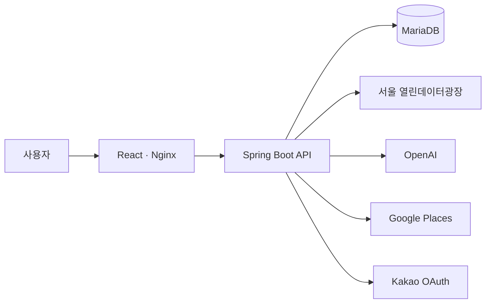

<div align="center">


# CultureMate

### 행사를 찾고, 하루를 완성하다.

서울의 문화행사를 발견하고 주변 장소를 연결해<br />
나만의 문화 코스로 저장하고 공유하는 문화생활 플래너입니다.

[](https://github.com/CultureMate/CultureMate-platform)
[](https://github.com/CultureMate/CultureMate-frontend)
[](https://github.com/CultureMate/CultureMate-backend)

</div>

---

## CultureMate가 만드는 경험

CultureMate는 행사 하나를 찾는 데서 끝나지 않습니다. 문화행사를 고른 뒤 주변 카페와 음식점을 연결하고, 방문 순서를 정리해 하나의 문화 코스로 저장하고 공유할 수 있습니다.

```text
문화행사 발견  →  AI 소개 확인  →  주변·사이 장소 추천  →  코스 저장  →  링크 공유
```

| 🎭 행사 탐색 | ✨ AI 소개 | ☕ 장소 추천 | 🗺️ 코스 구성 | 🔗 공유 |
|---|---|---|---|---|
| 서울 문화행사 검색 | 2~3문장 핵심 소개 | 주변·사이 장소 탐색 | 행사와 장소 순서 편집 | 읽기 전용 코스 링크 |

## 프로젝트 저장소

| 저장소 | 설명 |
|---|---|
| **[CultureMate-platform](https://github.com/CultureMate/CultureMate-platform)** | 전체 프로젝트 소개, 통합 실행, 아키텍처 문서 |
| [CultureMate-frontend](https://github.com/CultureMate/CultureMate-frontend) | React 기반 사용자 화면과 문화 코스 경험 |
| [CultureMate-backend](https://github.com/CultureMate/CultureMate-backend) | Spring Boot REST API, 인증, 외부 API 연동과 데이터 저장 |

> 프로젝트 전체를 실행하려면 [CultureMate-platform](https://github.com/CultureMate/CultureMate-platform)의 Quick Start를 확인하세요.

## 기술 구성

<div align="center">


</div>



## 팀 CultureMate

| 이름 | 역할 | 주요 담당 |
|---|---|---|
| 강민구 | Backend · Team Lead | AI 소개문, Google Places, 코스 API, 사이 장소 추천 |
| 최환우 | Backend | 카카오 로그인, 서울시 API, 조회수, ERD, Docker, 통합 개선 |
| 김우석 | Backend | 관심 행사, 마이페이지, 댓글, 서울시 원본 정제, 테스트 문서 |
| 문한일 | Frontend | 행사 탐색·상세, 지도, 댓글, 코스·공유 화면, UI 개선 |
| 손수연 | Frontend | 로그인, 프로필, 관심 목록, 캘린더, 마이페이지 |

---

<div align="center">

LG CNS AM INSPIRE CAMP 6기 미니 프로젝트

</div>
