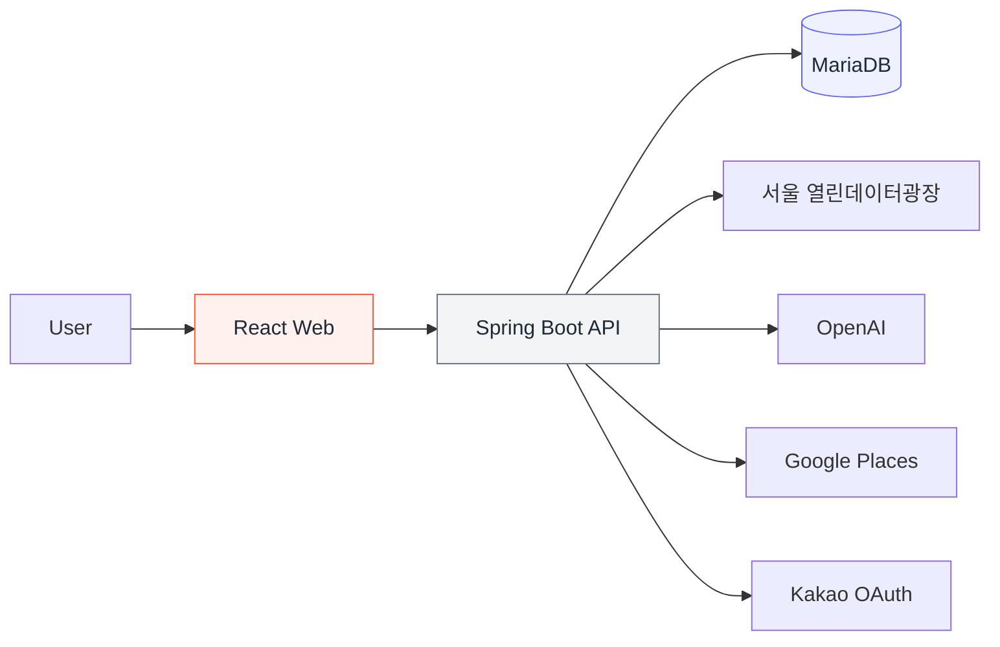

<div align="center">


# CultureMate

### 문화행사 발견에서 하루 코스 완성까지

서울의 문화행사를 탐색하고, AI 소개와 장소 추천을 바탕으로<br />
나만의 문화 코스를 만들고 공유하는 서비스입니다.

<br />

[](https://culturemate.github.io/CultureMate-frontend/#/)
[](https://github.com/CultureMate/CultureMate-platform)

<sub>데모는 별도 설치 없이 실행되며, 공개용 샘플 데이터를 사용합니다.</sub>

</div>

<br />

<div align="center">
  
  &nbsp;
  
  &nbsp;
  
</div>

<div align="center">
  <sub>홈 추천 · 행사 상세 · 목록과 코스 담기</sub>
</div>

---

## Product

문화행사 정보는 많지만, **무엇을 볼지 고른 뒤 어디를 함께 갈지 계획하는 과정**은 여전히 여러 서비스에 흩어져 있습니다. CultureMate는 탐색부터 하루 동선 구성까지 하나의 흐름으로 연결합니다.

| 01 · Discover | 02 · Understand | 03 · Plan | 04 · Save & Share |
|:---:|:---:|:---:|:---:|
| 서울 문화행사 탐색 | AI 핵심 소개 확인 | 주변·사이 장소 추천 | 코스 저장과 링크 공유 |
| 관심 분야와 일정에 맞는 행사 발견 | 긴 원문을 2~3문장으로 요약 | 행사 사이에 들를 장소 탐색 | 방문 순서를 정리해 재사용 |

```text
행사 발견  →  AI 소개  →  장소 추천  →  동선 구성  →  코스 공유
```

## Key Features

| 기능 | 사용자 가치 | 구현 포인트 |
|---|---|---|
| **문화행사 탐색** | 서울의 공연·전시·축제를 한곳에서 검색 | 서울시 문화행사 데이터 수집·정제 |
| **AI 행사 소개** | 긴 행사 정보를 짧고 빠르게 이해 | 제한된 입력 필드, 생성 결과 저장·재사용 |
| **장소 추천** | 행사 주변 또는 두 행사 사이의 장소 탐색 | 위치 기반 Google Places 검색 |
| **문화 코스** | 행사와 장소를 하나의 일정으로 구성 | 순서 편집, 저장, 읽기 전용 공유 링크 |
| **개인화** | 관심 행사와 캘린더를 다시 확인 | 카카오 로그인, 관심 목록, 마이페이지 |

## Architecture



<div align="center">


</div>

## Engineering Highlights

- **외부 데이터 안정화** — 서울시 문화행사 원본을 서비스 모델로 정제하고 중복 데이터를 병합했습니다.
- **AI 비용과 응답 최적화** — 생성된 소개문을 행사별로 저장하여 같은 요청에서 재호출하지 않습니다.
- **위치 기반 추천** — 행사 주변뿐 아니라 두 행사 사이의 장소까지 검색할 수 있도록 추천 흐름을 확장했습니다.
- **재현 가능한 실행 환경** — 프론트엔드·백엔드·DB를 Docker Compose로 통합하고 GitHub Actions로 검증합니다.
- **독립 실행 데모** — 백엔드와 API 키 없이도 주요 사용자 흐름을 확인할 수 있는 GitHub Pages 데모를 제공합니다.

## Repositories

| Repository | Role | Links |
|---|---|---|
| **CultureMate-platform** | 통합 실행, 시스템 구성, 프로젝트 문서 | [Repository](https://github.com/CultureMate/CultureMate-platform) |
| **CultureMate-frontend** | React 기반 사용자 화면과 문화 코스 경험 | [Repository](https://github.com/CultureMate/CultureMate-frontend) · [Live Demo](https://culturemate.github.io/CultureMate-frontend/#/) |
| **CultureMate-backend** | REST API, 인증, 외부 API 연동, 데이터 저장 | [Repository](https://github.com/CultureMate/CultureMate-backend) |

## Team

| Member | Role | Ownership |
|---|---|---|
| 강민구 | Backend · Team Lead | AI 소개문, Google Places, 코스 API, 사이 장소 추천 |
| **최환우** | **Backend** | **카카오 로그인, 서울시 API, 조회수, ERD, Docker, 통합 개선** |
| 김우석 | Backend | 관심 행사, 마이페이지, 댓글, 서울시 원본 정제, 테스트 문서 |
| 문한일 | Frontend | 행사 탐색·상세, 지도, 댓글, 코스·공유 화면, UI 개선 |
| 손수연 | Frontend | 로그인, 프로필, 관심 목록, 캘린더, 마이페이지 |

---

<div align="center">

**LG CNS AM INSPIRE CAMP 6기 · Mini Project**

[데모 체험](https://culturemate.github.io/CultureMate-frontend/#/) · [프로젝트 문서](https://github.com/CultureMate/CultureMate-platform)

</div>
