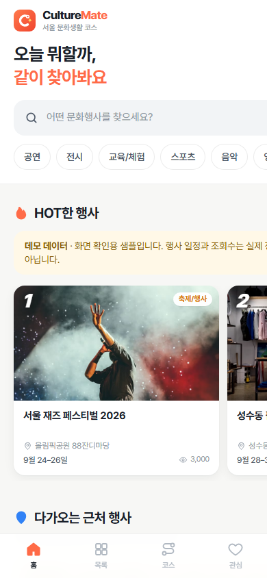
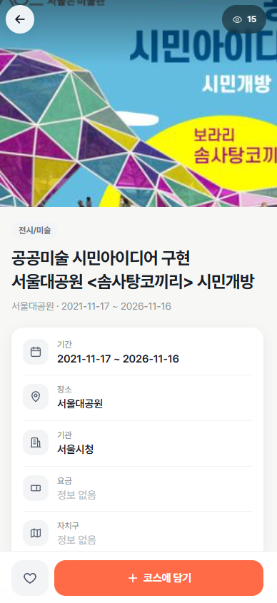
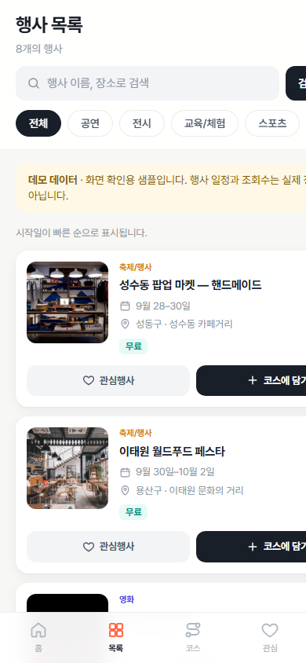
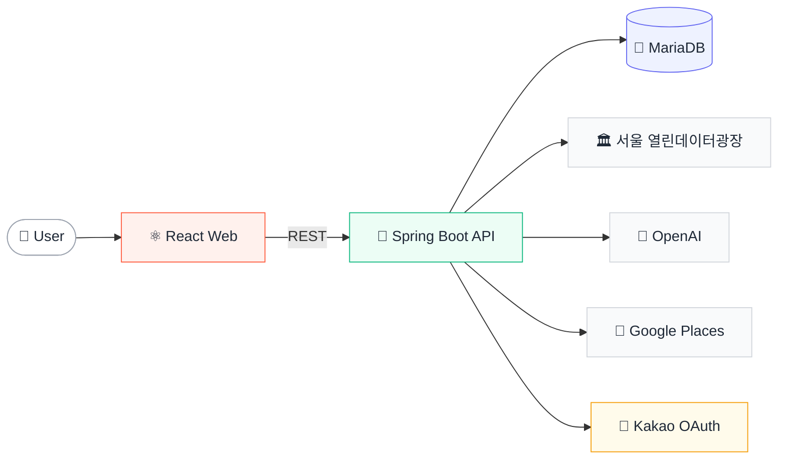

### 🎭 문화행사 발견에서 하루 코스 완성까지

서울의 문화행사를 탐색하고, **AI 소개**와 **장소 추천**을 바탕으로 
나만의 문화 코스를 만들고 공유하는 서비스입니다.

 

데모는 별도 설치 없이 실행되며, 공개용 샘플 데이터를 사용합니다.

 

<table align="center">
  <tr>
    <td align="center" width="33%">
      
       <b>🏠 홈 추천</b>
       HOT 행사 · 다가오는 근처 행사
    </td>
    <td align="center" width="33%">
      
       <b>📄 행사 상세</b>
       AI 소개 · 주변 장소
    </td>
    <td align="center" width="33%">
      
       <b>🗂️ 목록 · 코스 담기</b>
       조건 검색 · 코스에 추가
    </td>
  </tr>
</table>

 

## 💡 Why CultureMate

> 문화행사 정보는 많지만, **무엇을 볼지 고른 뒤 어디를 함께 갈지 계획하는 과정**은 여전히 여러 서비스에 흩어져 있습니다. 
> CultureMate는 탐색부터 하루 동선 구성까지 **하나의 흐름**으로 연결합니다.

| 🔎 01 · Discover | 🤖 02 · Understand | 📍 03 · Plan | 🔗 04 · Save & Share |
|:---:|:---:|:---:|:---:|
| **서울 문화행사 탐색** | **AI 핵심 소개 확인** | **주변·사이 장소 추천** | **코스 저장과 링크 공유** |
| 관심 분야와 일정에 맞는 행사 발견 | 긴 원문을 2~3문장으로 요약 | 행사 사이에 들를 장소 탐색 | 방문 순서를 정리해 재사용 |

**행사 발견** ➜ **AI 소개** ➜ **장소 추천** ➜ **동선 구성** ➜ **코스 공유**

 

## ✨ Key Features

<table>
  <tr>
    <td width="50%" valign="top">
      <h3>🎫 문화행사 탐색</h3>
      서울의 공연·전시·축제를 한곳에서 검색
       🛠 서울시 문화행사 데이터 수집·정제
    </td>
    <td width="50%" valign="top">
      <h3>🤖 AI 행사 소개</h3>
      긴 행사 정보를 짧고 빠르게 이해
       🛠 제한된 입력 필드, 생성 결과 저장·재사용
    </td>
  </tr>
  <tr>
    <td width="50%" valign="top">
      <h3>📍 장소 추천</h3>
      행사 주변 또는 두 행사 사이의 장소 탐색
       🛠 위치 기반 Google Places 검색
    </td>
    <td width="50%" valign="top">
      <h3>🗺️ 문화 코스</h3>
      행사와 장소를 하나의 일정으로 구성
       🛠 순서 편집, 저장, 읽기 전용 공유 링크
    </td>
  </tr>
  <tr>
    <td colspan="2" valign="top">
      <h3>💛 개인화</h3>
      관심 행사와 캘린더를 다시 확인
       🛠 카카오 로그인, 관심 목록, 마이페이지
    </td>
  </tr>
</table>

 

## 🏗️ Architecture

## 🧰 Tech Stack

| Layer | Stack |
|:---:|:---|
| **Frontend** |   |
| **Backend** |   |
| **Database** |  |
| **Infra · CI** |   |
| **External API** |    |

 

## 🔧 Engineering Highlights

| | 고민 | 해결 |
|:---:|---|---|
| 🧹 | **외부 데이터 안정화** | 서울시 문화행사 원본을 서비스 모델로 정제하고 중복 데이터를 병합했습니다. |
| 💸 | **AI 비용과 응답 최적화** | 생성된 소개문을 행사별로 저장하여 같은 요청에서 재호출하지 않습니다. |
| 🧭 | **위치 기반 추천** | 행사 주변뿐 아니라 두 행사 사이의 장소까지 검색할 수 있도록 추천 흐름을 확장했습니다. |
| 🐳 | **재현 가능한 실행 환경** | 프론트엔드·백엔드·DB를 Docker Compose로 통합하고 GitHub Actions로 검증합니다. |
| 🚀 | **독립 실행 데모** | 백엔드와 API 키 없이도 주요 사용자 흐름을 확인할 수 있는 GitHub Pages 데모를 제공합니다. |

 

## 📦 Repositories

| Repository | Role | Links |
|---|---|:---:|
| 🧩 **CultureMate-platform** | 통합 실행, 시스템 구성, 프로젝트 문서 |  |
| 🎨 **CultureMate-frontend** | React 기반 사용자 화면과 문화 코스 경험 |   |
| ⚙️ **CultureMate-backend** | REST API, 인증, 외부 API 연동, 데이터 저장 |  |

 

## 👥 Team

| Member | Role | Ownership |
|:---:|:---:|---|
| **강민구** |  | AI 소개문, Google Places, 코스 API, 사이 장소 추천 |
| **최환우** |  | **카카오 로그인, 서울시 API, 조회수, ERD, Docker, 통합 개선** |
| **김우석** |  | 관심 행사, 마이페이지, 댓글, 서울시 원본 정제, 테스트 문서 |
| **문한일** |  | 행사 탐색·상세, 지도, 댓글, 코스·공유 화면, UI 개선 |
| **손수연** |  | 로그인, 프로필, 관심 목록, 캘린더, 마이페이지 |

 

**🎓 LG CNS AM INSPIRE CAMP 6기 · Mini Project**

[데모 체험](https://culturemate.github.io/CultureMate-frontend/#/) · [프로젝트 문서](https://github.com/CultureMate/CultureMate-platform)

